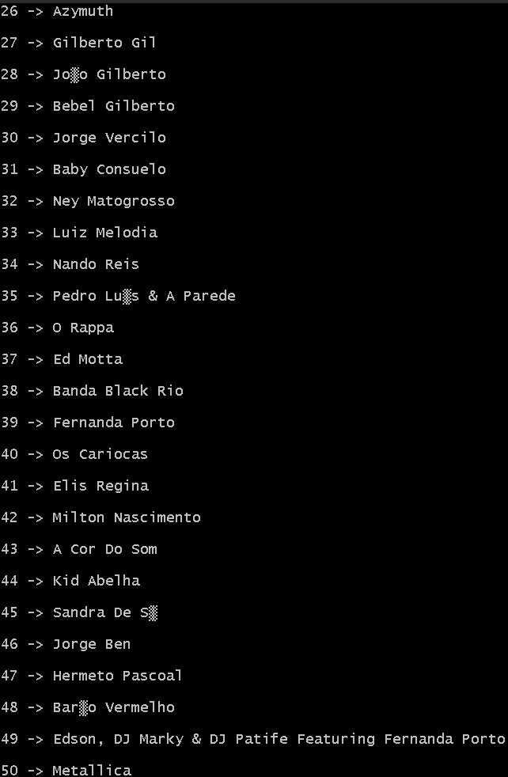

# dbSlutprojektITHS
## Description
This project is about running a SQL-script that will organize a .csv table into a readable list  

## Requirements
Docker desktop (what i use)  
Bash (any terminal with Git, Bash and mySQL commands)  

## Instructions
mkdir dbSlutprojektITHS  
cd dbSlutprojektITHS  

git init  
git clone https://github.com/DavidWaldholm/dbSlutprojektITHS  

 

curl -L  https://gist.github.com/miwashiab/e39a3228f0b389b6f3eca1b8c613bb2e/raw/db.sql -o db.sql  

docker run --name iths-mysql\  
           -e MYSQL_ROOT_PASSWORD=root\  
           -e MYSQL_USER=iths\  
           -e MYSQL_PASSWORD=iths\  
           -e MYSQL_DATABASE=iths\  
           -p 3306:3306\   
           -d mysql/mysql-server:latest  

docker exec -i iths-mysql mysql -uroot -proot < db.sql  
docker exec -it iths-mysql bash  

mysql -uroot -proot  

use Chinook;  

GRANT ALL PRIVILEGES ON iths.* TO 'iths'@'%';  
GRANT ALL PRIVILEGES ON Chinook.* TO 'iths'@'%';  

GRANT FILE ON *.* TO 'iths'@'%';  
SHOW GRANTS FOR iths;  
exit

exit

gradle run  

## Result  
If everything is working properly your terminal should print out this when typing "gradle run"  

  
  
  
